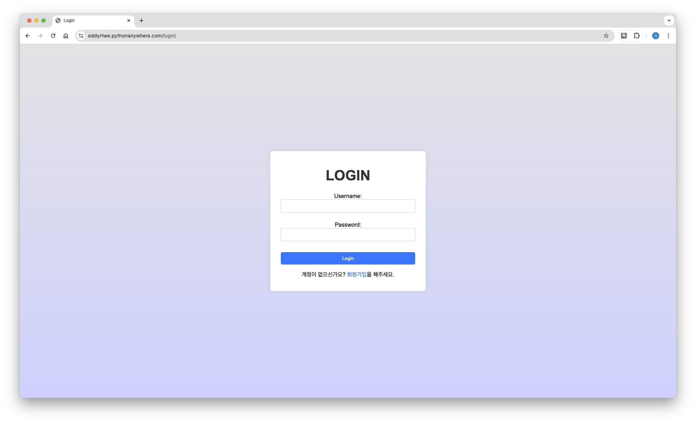

[](https://www.python.org/)
[](https://www.djangoproject.com/)
[](https://www.sqlite.org/)
[](https://developer.mozilla.org/ko/docs/Learn/HTML)
[](https://developer.mozilla.org/ko/docs/Web/JavaScript)
# 게시판 Bulletin Board

> **Django**를 이용한 게시판 프로젝트입니다. 사용자 회원가입, 로그인, 글 작성/수정/삭제, 목록/상세 보기 기능 사용이 가능합니다.

<br/>

## 실사용 화면 

- **로딩 화면**  
  - 게시판과 로그인 창으로 갈 수 있는 페이지  
  - 

- **메인 페이지**  
  - 게시글 목록 테이블, “글 작성” 버튼  
  - 

- **게시글 작성**
  - 게시글 작성 페이지
  - 
   
- **게시글 상세 보기**  
  - 게시글 내용, 작성자, 작성일, 수정/삭제 버튼  
  - 

- **로그인/회원가입 페이지**  
  - 사용자 입력 폼 및 에러 메시지 표시  
  -  

- **비밀번호 암호화**
  - 비밀번호 암호화 과정을 거침
  - 


## 1. 주요 기능

1. **회원가입 & 로그인**  
   - 커스텀 유저 모델(CustomUser)을 사용하여 Django의 인증 시스템을 확장 
   - 비밀번호 확인(Password confirm) 기능 및 입력 데이터 유효성 검사

2. **게시글 작성 & 목록 보기**  
   - 로그인 후 제목, 내용 입력으로 새 글 작성 가능 
   - 전체 게시글 목록을 테이블 형태로 확인 가능 

3. **게시글 상세 보기**  
   - 목록에서 특정 게시글을 클릭하면, 해당 게시글의 제목, 내용, 작성자, 작성 시간 등이 상세 페이지에 표시

4. **게시글 수정 & 삭제**
   - **로그인한 사용자**만 수정/삭제 버튼 노출
   - 글 작성자와 현재 로그인한 사용자의 ID가 일치하는 경우에만 삭제 가능
   - 수정·삭제 시 보안 강화(게시글 작성자만 변경 권한)

5. **데이터 유효성 검증 강화**  
   - 빈 제목/내용으로 글 작성 시 경고창 또는 폼 요구 속성(`required`)으로 사용자 실수 방지  
   - 비밀번호는 해시(hashing) 처리 후 데이터베이스에 저장(기존 비밀번호도 마이그레이션 과정에서 해싱 적용) 

6. **반응형(모바일 호환)**  
   - 2024년 2월 14일 업데이트에서 스크린 사이즈를 조정해 모바일 환경에서도 사용 가능하도록 수정 

<br/>


## 2. 작동 방식

1. **메인 페이지**  
   - 게시판 목록(`pages/views.py` -> `post_list` 함수)  
   - 전체 게시글 확인, 특정 글 클릭 시 상세 페이지로 이동
   - 로그인 여부에 따라 '글 작성' 버튼 표시 유/무

2. **회원가입 / 로그인 / 로그아웃**  
   - `accounts/views.py`에 구현
   - 회원가입 시 `CustomUser` 모델에 유저 정보를 저장하며, 비밀번호 해시 처리 
   - 로그인 시 세션 발급으로 인증 상태를 유지

3. **게시글 작성**  
   - 로그인 상태에서 '글 작성' 버튼 클릭 → `pages/views.py`의 `post_create` 함수  
   - 작성 완료 후, DB(Post 모델)에 반영
   - 작성자가 현재 로그인된 유저인지 확인하여 `author` 필드에 저장 

4. **게시글 수정**  
   - 수정하려는 게시글 작성자와 현재 로그인 사용자가 같은 경우에만 접근 가능  
   - 수정 후 DB에 반영, 수정 시간은 별도로 저장하지 않음(필요 시 `updated_at` 필드 추가 가능)  

5. **게시글 삭제**  
   - 삭제하려는 게시글의 `author.id`와 현재 로그인한 사용자의 `id` 비교  
   - 일치하면 삭제, 불일치 시 리다이렉트 처리 

<br/>

## 3. 버그 해결 과정

1. **수정/삭제 권한 문제**  
   - 초기에는 로그인하지 않아도 URL만 안다면 수정·삭제가 가능했던 보안 이슈  
   - **해결**
     - Django의 `@login_required` 데코레이터 또는 권한 체크 로직 추가  
     - 수정/삭제 페이지 진입 시, 작성자와 로그인 유저를 비교하여 불일치 시 접근 차단  

2. **비밀번호 평문 저장**  
   - 기존에는 비밀번호를 평문(문자열)으로 저장하여 보안 문제 발생  
   - **해결**  
     - Django의 기본 `UserCreationForm`과 `Password hashing` 메커니즘 활용  
     - 기존 회원의 비밀번호도 해시 후 재저장 (마이그레이션 단계에서 처리)  

3. **빈 제목/내용 작성 시 데이터 소실**  
   - 사용자가 실수로 제목/내용을 입력하지 않고 제출할 경우, 빈 게시물이 DB에 저장되거나 작성내용이 사라지는 문제  
   - **해결** 
     - HTML 폼에 `required` 속성 추가.  
     - Django 폼 유효성 검증을 통해 필드가 비어 있으면 에러 메시지 표시  

4. **모바일 대응 문제**  
   - 모바일 환경에서 화면이 잘려 보이거나 UI가 깨지는 문제  
   - **해결** 
     - 반응형 CSS 적용 및 뷰포트 설정으로 모바일 해상도 대응 

<br/>

## 4. 프로젝트 실행 방법

1. **필수 라이브러리 설치**  
   ```bash
   pip install django
   ```
   - 필요에 따라 `pip install -r requirements.txt` 로 일괄 설치할 수도 있음

2. **데이터베이스 마이그레이션**  
   ```bash
   python manage.py makemigrations
   python manage.py migrate
   ```

3. **개발 서버 실행**  
   ```bash
   python manage.py runserver
   ```
   - 브라우저에서 `http://127.0.0.1:8000/` 접속 

4. **(선택) 가상환경 사용**  
   - 프로젝트 분리를 위해 venv 가상환경 사용 권장  

5. **(선택) 관리자 계정 생성**  
   ```bash
   python manage.py createsuperuser
   ```
   - 이후 `http://127.0.0.1:8000/admin/` 에 접속해 관리자 기능 사용 가능  

<br/>
